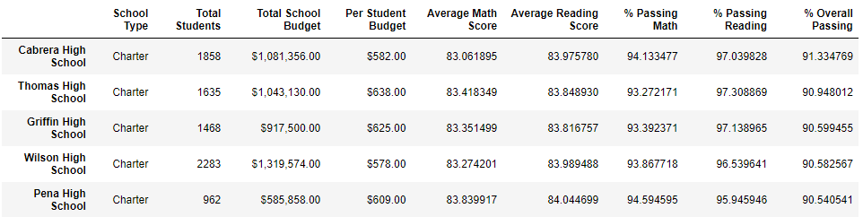
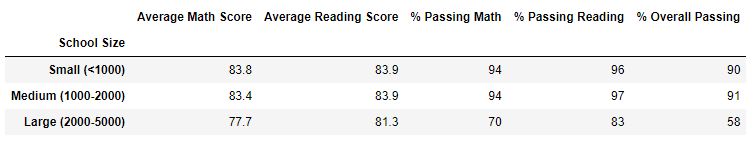

# School District Analysis

## Overview of Project

### Purpose

The school board would like an analysis of standardized test scores to uncover insights on school performance to help them make budget decisions and prioritize. They recently discovered evidence of academic dishonesty regarding the scores for ninth graders at Thomas High School and would like to know how taking out these scores affects the overall analysis. I will be using Pandas to clean and summarize the data to find any trends or patterns based on the school information.

## Results

### District Summary
- The district summary average math score decreased by a tenth of a point, while the average reading score stayed the same. The passing percentages, to the nearest whole number, also remained unchanged.
  - Original

  - Updated

### School Summary
- The school summary is the same for all the schools besides Thomas High School, which changed slightly as seen below.
  - Original

  - Updated

### Thomas High School Performance
- Although replacing the Thomas High School ninth-grade scores slightly changed some of their school summary numbers, they are still ranked second based on the overall passing percentage. 
  - Original

  - Updated

### Scores by Grade
- The average math and reading scores by grade are not affected except for the ninth-grade scores for Thomas High School which are now NaN, as expected.
  - Math Scores and Reading Scores, respectively

### Scores by School Spending
- The scores by school spending are not affected by replacing the ninth-grade scores. The final formatted DataFrames are the same.

### Scores by School Size
- The scores by school size are not affected by replacing the ninth-grade scores. The final formatted DataFrames are the same.

### Scores by School Type
- The scores by school type are not affected by replacing the ninth-grade scores. The final formatted DataFrames are the same.

## Summary

### Changes in the Updated Analysis

After reading and math scores for the ninth grade at Thomas High School were replaced with NaNs, the overall district average math score decreased from 79.0 to 78.9. Thomas High School's average reading score increased from 83.8 to 83.9. The scores by grade are no longer directly comparable between all schools since Thomas High School has missing data for one grade. Overall, replacing the scores did not significantly change the analysis because most of the rounded summary values are the same.

